<h1 align="center"> 2022 SW Education for Vietnamese Students in Korea </h1>
<p align="center">
 
</p>
<h1 align="center"> Assignment Report </h1>

**Author: Do Truong Dong** <br>
Email: <truongdong.sju@gmail.com>

# 1. Topic chosing
I chose topic **#2** for my study. The URL to access the data [here](https://www.data.go.kr/data/15098931/openapi.do).

### <span style="color:red">Korean</span>:
  **유기견보호** \
농림축산식품부 농림축산검역본부 동물보호관리시스템 유기동물 조회 서비스: 동물보호관리시스템 유기동물 정보를 조회할 수 있다.

### <span style="color:blue">English</span>:
Ministry of Agriculture, Food and Rural Affairs, Agriculture, Forestry and Livestock Quarantine Headquarters: Animal protection management system abandoned animal information inquiry service.


# 2. Data Overview
This is a service that allows us to inquire information on abandoned animals of the animal protection management system and provides city and county inquiry API, city and county inquiry API, shelter inquiry API, and breed inquiry API so that you can inquire about additional information included in abandoned animal information.

The guide for using this Animal Protection Management System Open API can be accessed [here](https://github.com/TruongDong-Do/2022_VNKR_SW_Training/blob/7ad04cd2ed89c9f83bb7f09fc8eebdbea0fcecc4/%EB%8F%99%EB%AC%BC%EB%B3%B4%ED%98%B8%EA%B4%80%EB%A6%AC%EC%8B%9C%EC%8A%A4%ED%85%9C%20Open%20API%20%ED%99%9C%EC%9A%A9%EA%B0%80%EC%9D%B4%EB%93%9C%20-%20%EC%9C%A0%EA%B8%B0%EB%8F%99%EB%AC%BC%20%EC%A1%B0%ED%9A%8C%20%EC%84%9C%EB%B9%84%EC%8A%A4.docx). In this file, we can find all the information about this ***Abandoned Animal Inquiry Service*** consist of data properties, data inquiry link, data inquiry code.

<p align="center">
 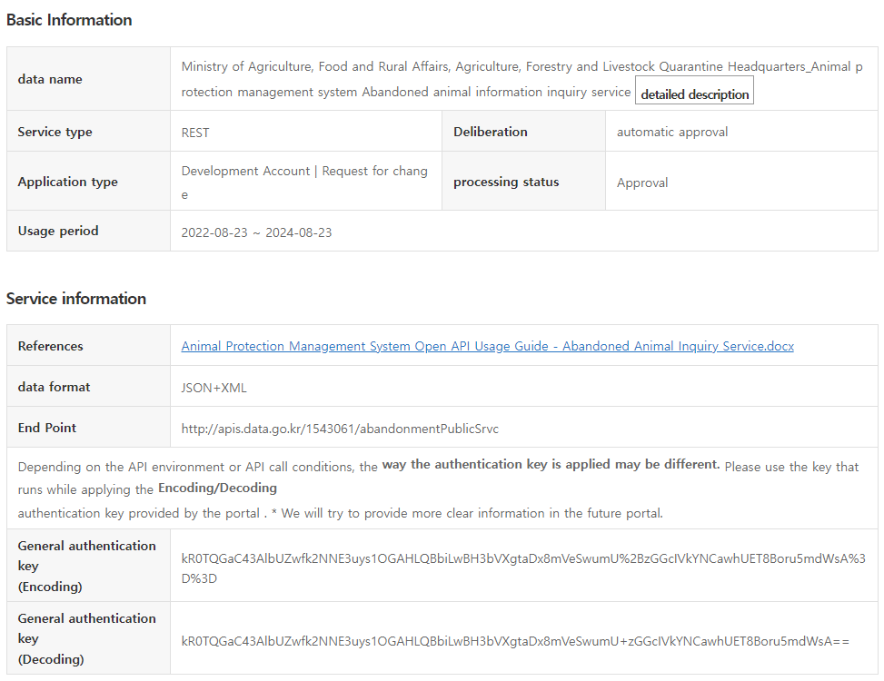
</p>
<p align = "center">
 <em>Figure 1: The basic and service information of the data.</em>
</p>

### The Java code to request the data
```java
import java.io.InputStreamReader;
import java.net.HttpURLConnection;
import java.net.URL;
import java.net.URLEncoder;
import java.io.BufferedReader;
import java.io.IOException;

public class ApiExplorer {
    public static void main(String[] args) throws IOException {
        StringBuilder urlBuilder = new StringBuilder("http://apis.data.go.kr/1543061/abandonmentPublicSrvc/abandonmentPublic"); /*URL*/
        urlBuilder.append("?" + URLEncoder.encode("serviceKey","UTF-8") + "=서비스키"); /*Service Key*/
        urlBuilder.append("&" + URLEncoder.encode("bgnde","UTF-8") + "=" + URLEncoder.encode(" ", "UTF-8")); /*유기날짜(검색 시작일) (YYYYMMDD)*/
        urlBuilder.append("&" + URLEncoder.encode("endde","UTF-8") + "=" + URLEncoder.encode(" ", "UTF-8")); /*유기날짜(검색 종료일) (YYYYMMDD)*/
        urlBuilder.append("&" + URLEncoder.encode("upkind","UTF-8") + "=" + URLEncoder.encode(" ", "UTF-8")); /*축종코드 (개 : 417000, 고양이 : 422400, 기타 : 429900)*/
        urlBuilder.append("&" + URLEncoder.encode("kind","UTF-8") + "=" + URLEncoder.encode(" ", "UTF-8")); /*품종코드 (품종 조회 OPEN API 참조)*/
        urlBuilder.append("&" + URLEncoder.encode("upr_cd","UTF-8") + "=" + URLEncoder.encode(" ", "UTF-8")); /*시도코드 (시도 조회 OPEN API 참조)*/
        urlBuilder.append("&" + URLEncoder.encode("org_cd","UTF-8") + "=" + URLEncoder.encode(" ", "UTF-8")); /*시군구코드 (시군구 조회 OPEN API 참조)*/
        urlBuilder.append("&" + URLEncoder.encode("care_reg_no","UTF-8") + "=" + URLEncoder.encode(" ", "UTF-8")); /*보호소번호 (보호소 조회 OPEN API 참조)*/
        urlBuilder.append("&" + URLEncoder.encode("state","UTF-8") + "=" + URLEncoder.encode(" ", "UTF-8")); /*상태(전체 : null(빈값), 공고중 : notice, 보호중 : protect)*/
        urlBuilder.append("&" + URLEncoder.encode("neuter_yn","UTF-8") + "=" + URLEncoder.encode(" ", "UTF-8")); /*상태 (전체 : null(빈값), 예 : Y, 아니오 : N, 미상 : U)*/
        urlBuilder.append("&" + URLEncoder.encode("pageNo","UTF-8") + "=" + URLEncoder.encode("1", "UTF-8")); /*페이지 번호 (기본값 : 1)*/
        urlBuilder.append("&" + URLEncoder.encode("numOfRows","UTF-8") + "=" + URLEncoder.encode("10", "UTF-8")); /*페이지당 보여줄 개수 (1,000 이하), 기본값 : 10*/
        urlBuilder.append("&" + URLEncoder.encode("_type","UTF-8") + "=" + URLEncoder.encode(" ", "UTF-8")); /*xml(기본값) 또는 json*/
        URL url = new URL(urlBuilder.toString());
        HttpURLConnection conn = (HttpURLConnection) url.openConnection();
        conn.setRequestMethod("GET");
        conn.setRequestProperty("Content-type", "application/json");
        System.out.println("Response code: " + conn.getResponseCode());
        BufferedReader rd;
        if(conn.getResponseCode() >= 200 && conn.getResponseCode() <= 300) {
            rd = new BufferedReader(new InputStreamReader(conn.getInputStream()));
        } else {
            rd = new BufferedReader(new InputStreamReader(conn.getErrorStream()));
        }
        StringBuilder sb = new StringBuilder();
        String line;
        while ((line = rd.readLine()) != null) {
            sb.append(line);
        }
        rd.close();
        conn.disconnect();
        System.out.println(sb.toString());
    }
}
```

# 3. Solution for required tasks

## Task 1: Register for Public Data Membership

I registered an account with my Kakao. After registering and applying to use the data, the result is shown in Figure. 2 below. 

<p align="center">
 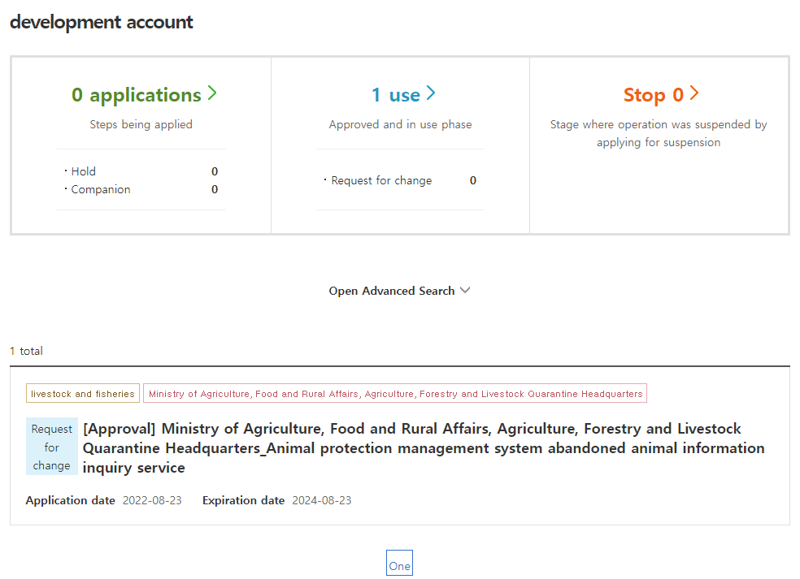
</p>
<p align = "center">
 <em>Figure 2: The application for using the data result.</em>
</p>

## Task 2: Azure Server Setting / Installing Elasticsearch, Logstash, Kibana

### 2.1. Azure Sever Setting

### Create the Virtual Machine and Setting up the Networking
I already create the Azure Virtual Machine with the IP ***20.228.243.183*** and set up the ports:
- http(80)
- https(443)
- mysql(3306)
- ssh(22)
- elasticsearch(9200)
- logstash(5044)
- kibana(5601)

Figure. 3 below show the Networking of my Virtual Machine

<p align="center">
 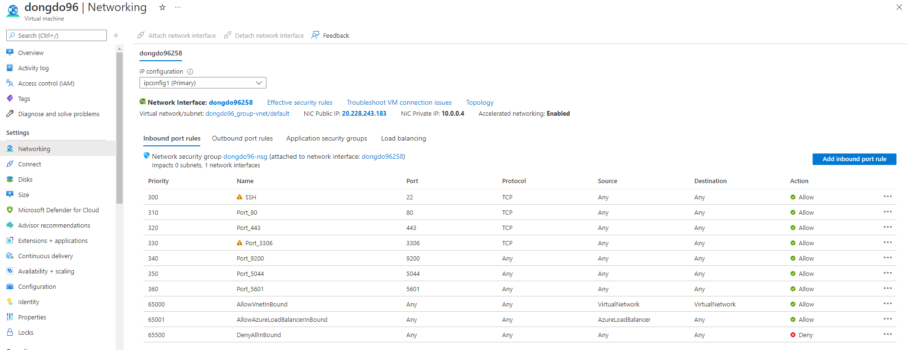
</p>
<p align = "center">
 <em>Figure 3: The Networking of Azure Virtual Machine.</em>
</p>

### Connect to the Server with Putty
<p align="center">
 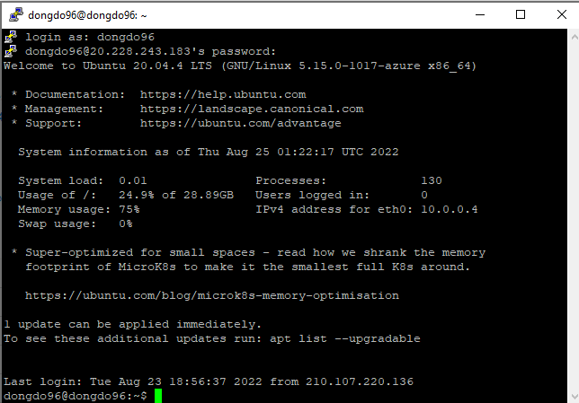
</p>
<p align = "center">
 <em>Figure 4: Connect to the Server with Putty result.</em>
</p>

### Setting the Linux Swap Area
<p align="center">
 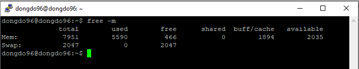
</p>
<p align = "center">
 <em>Figure 5: Setting the Swap Memory result.</em>
</p>

### Install Java
Java installation is prerequisite of installing elasticsearch, logstash, and kibana. So we have to install Java before installing the three programs.

#### Check if *Java* is installed.
<p align="center">
 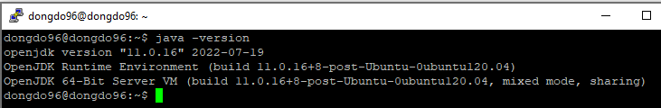
</p>
<p align = "center">
 <em>Figure 6: Java installation result.</em>
</p>

#### Set *Java* environment variable
<p align="center">
 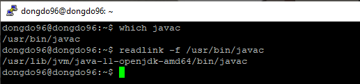
</p>
<p align = "center">
 <em>Figure 7: Java Environment Variable.</em>
</p>

### Install Elasticsearch
#### Check if *Elasticsearch* works.

Start the *Elasticsearch* and check the installation

<p align="center">
 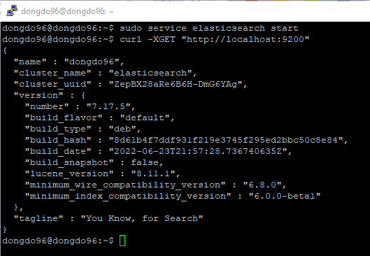
</p>
<p align = "center">
 <em>Figure 7: Elasticsearch installation result.</em>
</p>

#### Check if external access is allowed for *Elasticsearch* service.

<p align="center">
 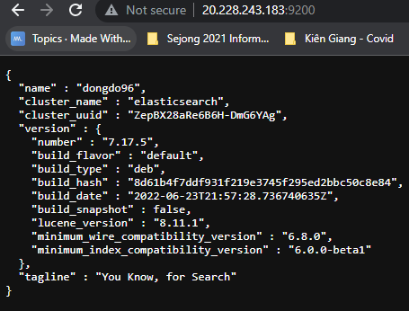
</p>
<p align = "center">
 <em>Figure 8: Elasticsearch External access result.</em>
</p>

### Install Logstash

### Install Kibana
#### Check if *Kibana* works.

Start the *Kibana* and check the installation

<p align="center">
 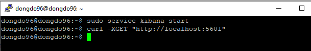
</p>
<p align = "center">
 <em>Figure 9: Kibana installation result.</em>
</p>

#### Check if external access is allowed for *Kibana* service.
The Kibana can be access with this address: http://20.228.243.183:5601/

<p align="center">
 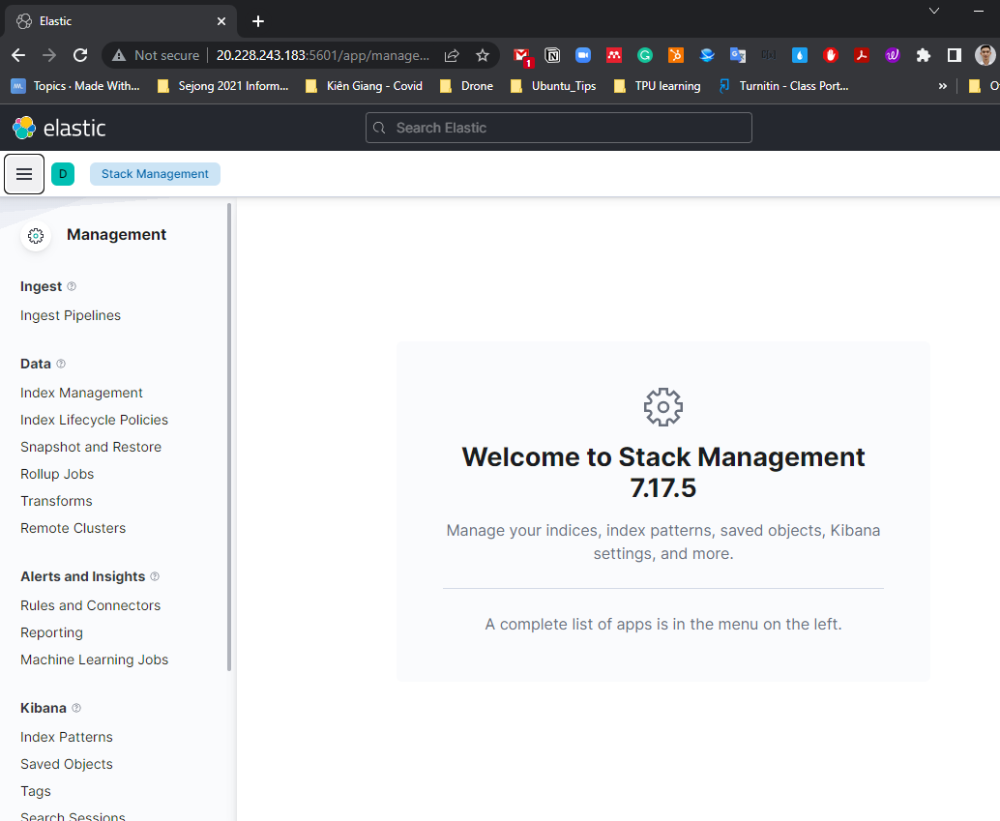
</p>
<p align = "center">
 <em>Figure 10: Kibana External access result.</em>
</p>

## Task 3: Download the data / Analysis and Visualize with Kibana
### Download the data from Open API

```
http://apis.data.go.kr/1543061/abandonmentPublicSrvc/abandonmentPublic?bgnde=20220801&endde=20220831&pageNo=1&numOfRows=999&serviceKey=인증키(URL Encode)
```
With the approved key as below, since the security issue, it should be shown in the figure as below.
<p align="center">
 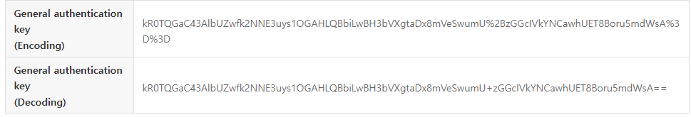
</p>
<p align = "center">
 <em>Figure 11: The key for downloading the data.</em>
</p>

I download eight ***csv*** files with save in [data folder](/data/), including:
 1. [abandonmentPublic202208-1.csv](data/abandonmentPublic202208-1.csv)
 2. [abandonmentPublic202208-2.csv](data/abandonmentPublic202208-2.csv)
 3. [abandonmentPublic202208-3.csv](data/abandonmentPublic202208-3.csv)
 4. [abandonmentPublic202208-4.csv](data/abandonmentPublic202208-4.csv)
 5. [abandonmentPublic202208-5.csv](data/abandonmentPublic202208-5.csv)
 6. [abandonmentPublic202208-6.csv](data/abandonmentPublic202208-6.csv)
 7. [abandonmentPublic202208-7.csv](data/abandonmentPublic202208-7.csv)
 8. [abandonmentPublic202208-8.csv](data/abandonmentPublic202208-8.csv)

All the file here are modified the time format. This mean it will have no problem about Korean language when open with MS Office.

### Import the ***csv*** file to the the **Data Visualizer** of Kibana

#### Upload

All of 8 files above were successfully imported to the ***Kibana***, the result is shown as figure below
<p align="center">
 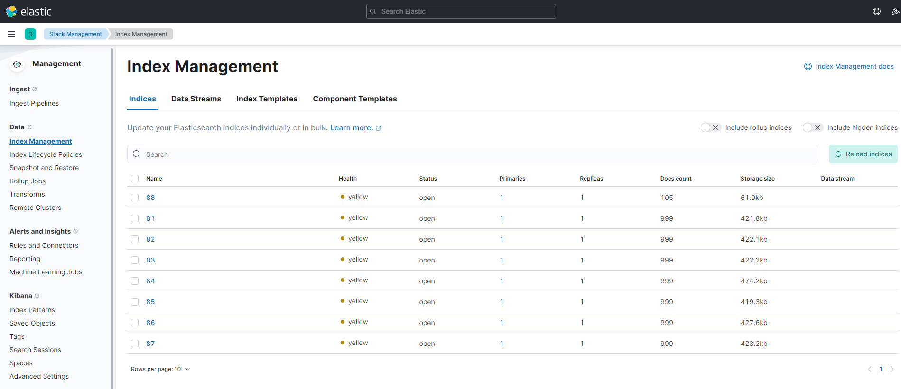
</p>
<p align = "center">
 <em>Figure 12: Index Management on Kibana.</em>
</p>

#### Indexing
A pattern named ***8**** is created consisted of all data from 8 *csv* files.

<p align="center">
 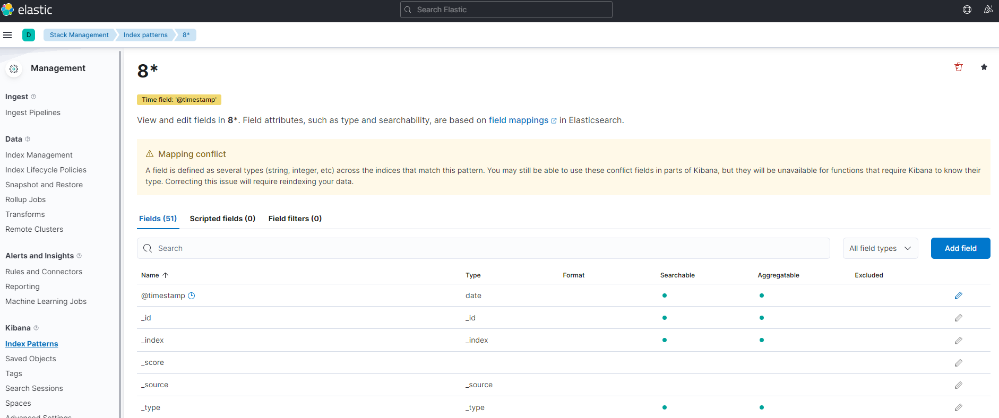
</p>
<p align = "center">
 <em>Figure 13: Index patterns on Kibana.</em>
</p>

#### Discover the Data

The data is chosen from ***Aug 1, 2022 00h:00m:00s*** to now
<p align="center">
 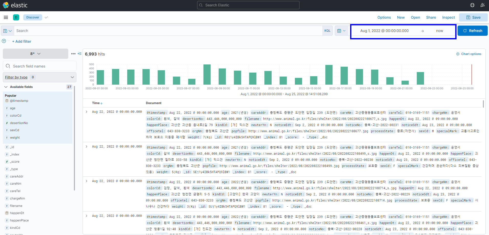
</p>
<p align = "center">
 <em>Figure 14: Data Discover.</em>
</p>

### Data Visualization with Kibana

Below is the  created Dashboard for this Data.\
The dashboard is save with the name [8_dashboard](http://20.228.243.183:5601/app/dashboards#/view/b416a310-2441-11ed-8784-6d5c5e4a8577?_g=(filters:!(),refreshInterval:(pause:!t,value:0),time:(from:'2022-07-31T15:00:00.000Z',to:now))).
<p align="center">
 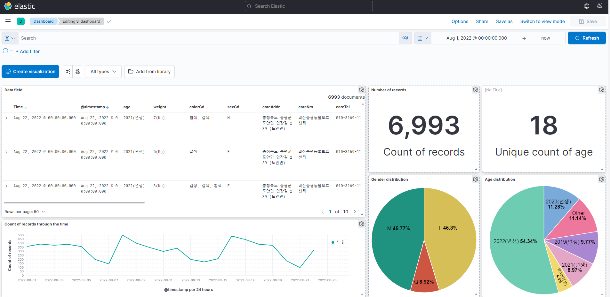
</p>

<p align="center">
 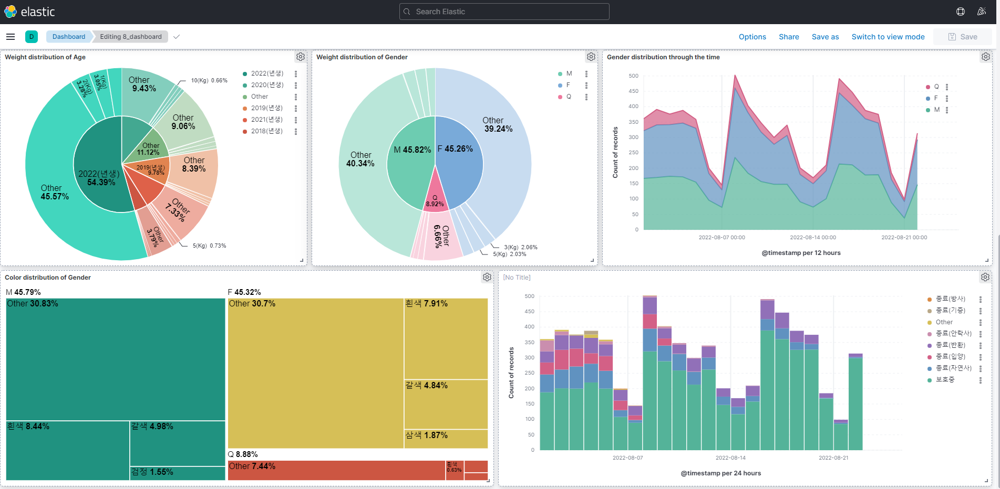
</p>

<h1 align="center"> -- The end -- </h1>

